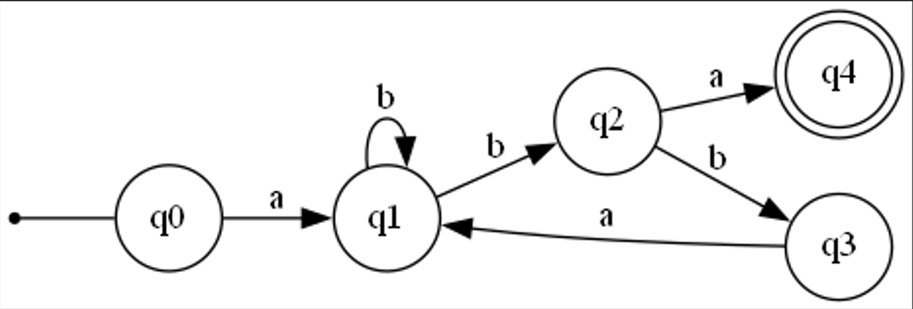

# Topic: Determinism in Finite Automata. Conversion from NDFA 2 DFA. Chomsky Hierarchy.

### Course: Formal Languages & Finite Automata
### Author: Botnari Ciprian
### Variant: 6

## Theory
**Deterministic finite automata** (DFA) guarantee a unique next state for a given state and input symbol, making them a simpler and more efficient model for computation. 

**Non-deterministic finite automata** (NDFA) allow for multiple transitions from a state with a given input symbol, leading to ambiguity and non-uniqueness of the next state. 

The conversion from **NDFA to DFA** involves constructing a set of states in the DFA corresponding to each subset of states in the NDFA, known as the powerset construction. This conversion simplifies NDFA and allows for easy analysis and verification of the automaton. 

**The Chomsky hierarchy** classifies formal languages based on their generative power, with regular languages recognized by finite automata, including both deterministic and non-deterministic finite automata.

## Objectives:

1. Understand what an automaton is and what it can be used for.
2. Provide a function in the grammar class that could classify the grammar based on Chomsky hierarchy.
3. Implement conversion of a finite automaton to a regular grammar.
4. Determine whether the FA is deterministic or non-deterministic.
5. Implement some functionality that would convert a NDFA to a DFA.
6. Represent the finite automaton graphically

## Implementation 

### Grammar Type
* The method classifyGrammar() classifies the grammar based on the Chomsky hierarchy.
* For each type of grammar, the method checks if the grammar is of that type by calling the corresponding method.

```
public ChomskyType classifyGrammar() {
        if (isRegularGrammar()) {
            return ChomskyType.TYPE_3;
        } else if (isContextFreeGrammar()) {
            return ChomskyType.TYPE_2;
        } else if (isContextSensitiveGrammar()) {
            return ChomskyType.TYPE_1;
        } else {
            return ChomskyType.TYPE_0;
        }
}
```

### Convert to Regular Grammar
* Creates a new grammar object that recognizes the same language as the finite automaton by iterating over its states and transitions to create productions. 
* It then adds productions for each final state that produces the empty string epsilon. 
* Finally, it creates an array of productions and returns a new grammar object representing the regular grammar.

```
public Grammar convertToRegularGrammar() {
        String[] nonTerminalVariables = this.states;
        String[] terminalVariables = this.alphabet;
        String startingCharacter = this.initialState;

        ArrayList<Production> productions = new ArrayList<>();

        for (String state : this.states) {
            for (Transition t : this.transitions) {
                Condition to create a production and add it to the list. 
            }
        }

        for (String finalState : this.finalStates) {
            productions.add(new Production(finalState, "ε"));
        }

        Production[] productionsArray = new Production[productions.size()];
        productionsArray = productions.toArray(productionsArray);

        return new Grammar(nonTerminalVariables, terminalVariables, productionsArray, startingCharacter);
}
```

### Is FA Deterministic
* Checks if the finite automaton is deterministic. 
* It creates a map to keep track of transitions for each state and input symbol pair. 
* It then iterates through all transitions and checks if there is more than one possible transition for any state and input symbol pair, returning false if so, and true if not.
```
public boolean isDeterministic() {
        // Create a map to keep track of transitions for each state and input symbol pair
        Map<String, Map<String, Set<String>>> transitionMap = new HashMap<>();

        // Iterate through all transitions
        for (Transition t : transitions) {
            // Get the source state and input symbol for this transition

            // If we haven't seen this state and input symbol pair before, create a new entry in the map

            // Add the destination state to the set of possible transitions for this pair
        }

        // Check if there is more than one possible transition for any state and input symbol pair
        for (String state : states) {
            // If there is more than one possible transition, FA is non-deterministic
            return false;
        }

        // If we haven't found any non-deterministic pairs, FA is deterministic
        return true;
    }
```

### NDFA to DFA
* Takes the power set of the given set of states
* Iterates over all the subsets of the power set, computing the corresponding transitions for each subset based on the given alphabet and set of transitions.
* The resulting transitions and final states are then used to create a new deterministic finite automaton, which is returned as the output.

```
public FiniteAutomaton convertToDFA() {
        Set<Set<String>> powerSet = getPowerSet(states);
        Map<Set<String>, Map<String, Set<String>>> dfaTransitions = new HashMap<>();
        Set<String> dfaFinalStates = new HashSet<>();
        String dfaInitialState = initialState;

        // Compute DFA transitions and final states
        for (Set<String> stateSet : powerSet) {
            Map<String, Set<String>> transitions = new HashMap<>();
            for (String symbol : alphabet) {
                ...............
            }
        }

        return new FiniteAutomaton(...args);
}
```

### FA to Graph
* The function returns a string representation of a finite automaton in Graphviz DOT format. 
* The DOT format is a plain text graph description language used to create graphs and visual representations of graphs.
* The string contains information about the states, transitions, and the initial and final states of the automaton.

```
public String toDot() {
        StringBuilder dot = new StringBuilder();
        dot.append("digraph finite_automaton {\n");
        dot.append("\trankdir=LR;\n");
        dot.append("\tsize=\"8,5\"\n");

        // add the states

        // add the transitions

        // add the initial state

        return dot.toString();
    }
```

## Results
1. Classify the grammar based on Chomsky hierarchy:
   Grammar {

   * Vn (Non-terminal) = [S, I, J, K]

   * Vt (Terminal) = [a, b, c, e, n, f, m]

   * P (Productions) = [S -> cI, I -> bJ, I -> fI, J -> nJ, J -> cS, I -> eK, K -> nK, I -> e, K -> m]

   * S (Starting symbol) = S

   }

   ===== Current grammar is of: TYPE_3 =====

2. Convert the finite automaton to regular grammar:

   FiniteAutomaton{

   * Q (states) = [q0, q1, q2, q3, q4]

   * Σ (alphabet) = [a, b]

   * Δ (transitions) = [q1, q1, q2, q3, q1, q4]

   * q0 (initial state) = q0

   * F (final States) = [q4]

   }

   Grammar {

   * Vn (Non-terminal) = [q0, q1, q2, q3, q4]

   * Vt (Terminal) = [a, b]

   * P (Productions) = [q0 -> aq1, q1 -> bq1, q1 -> bq2, q2 -> bq3, q2 -> aq4, q3 -> aq1, q4 -> ε]

   * S (Starting symbol) = q0

   }

3. Generate random words from converted grammar:
   * abbbaba
   * abbbbabbbaba
   * aba
   * aba
   * aba
   * abbba
   * abbbbbabba
   * abbabbaba
   * abbba
   * abba

4. Check if Finite Automaton is deterministic:

   ===== FA is deterministic: false =====

5. NFA to DFA:
   ===== DFA: FiniteAutomaton{
   * Q (states) = [[q2, q0], [q1, q2], [q3, q0], ..., [q1, q2, q3, q4, q0]]
   * Σ (alphabet) = [a, b]
   * Δ (transitions) = [[q1, q4], [q3], [q4], ...,  [q1, q2]]
   * q0 (initial state) = q0
   * F (final States) = [[q2, q4, q0], [q1, q3, q4], [q3, q4], ..., [q1, q2, q3, q4, q0]]} 

6. Display Finite Automaton graph:

   FiniteAutomaton{

   * Q (states) = [q0, q1, q2, q3, q4]

   * Σ (alphabet) = [a, b]

   * Δ (transitions) = [q1, q1, q2, q3, q1, q4]

   * q0 (initial state) = q0

   * F (final States) = [q4]

   }



## Conclusions 
Throughout this laboratory work, I explored the concept of determinism in finite automata, which is an essential topic in the field of computer science. My objectives were to understand what an automaton is and what it can be used for, classify a grammar based on Chomsky hierarchy, implement conversion of a finite automaton to a regular grammar, determine whether the FA is deterministic or non-deterministic, convert a NDFA to a DFA, and represent the finite automaton graphically.

In achieving these objectives, I learned about the various types of automata and their differences in terms of the rules that govern their operation. I also gained an understanding of the Chomsky hierarchy, which provides a framework for classifying formal grammars according to their expressive power. Through the implementation of the conversion of a finite automaton to a regular grammar, I was able to see the practical application of these concepts.

Furthermore, I developed an algorithm to determine whether a finite automaton is deterministic or non-deterministic, which is a crucial step in analyzing the behavior of an automaton. I also implemented functionality that would allow me to convert a non-deterministic finite automaton to a deterministic one, which is an essential technique for simplifying automata and making them more efficient.

Finally, I learned how to represent finite automata graphically using the DOT language, which provides an intuitive and visual way to understand the behavior of the automata. Through this laboratory work, I gained a deeper understanding of determinism in finite automata and the various techniques used to analyze and convert them.


